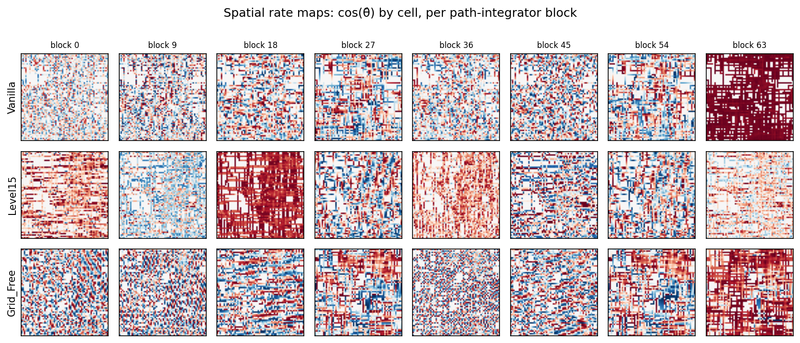
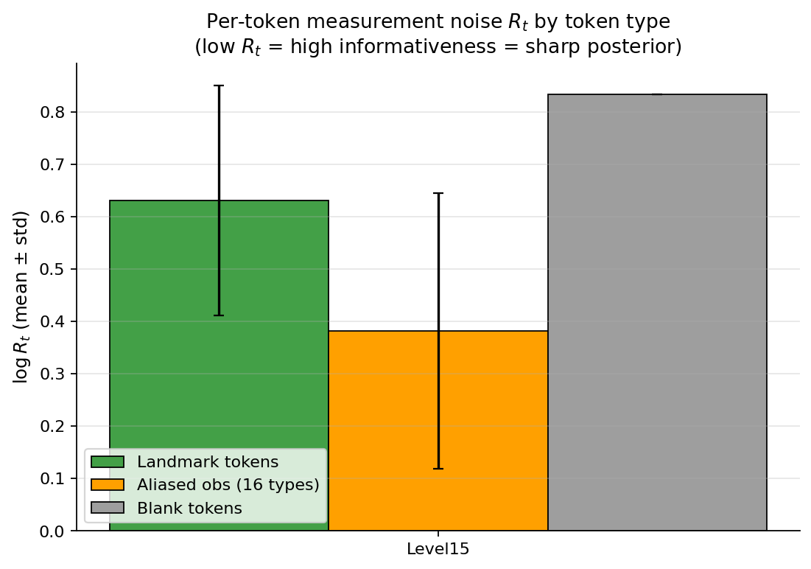
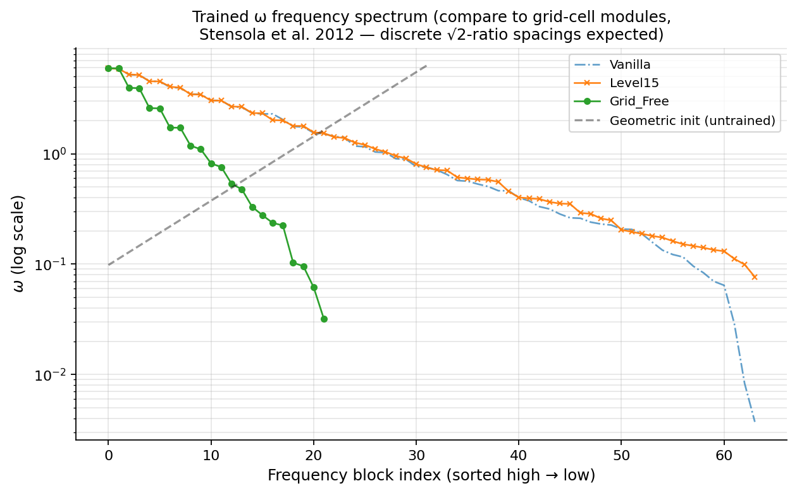

# Hippocampal / Grid-Cell Correspondence Analysis

Three tests connecting trained MapFormer representations to known properties of place / grid / boundary cells in entorhinal cortex and hippocampus.

## Test A — Spatial rate maps

Each path-integrator block is shown as a heatmap of cos(θ̂) by (x, y), averaged over a fresh-environment trajectory. Real grid cells produce hexagonal periodic patterns; real place cells produce single-peak fields.

**Grid score (Sargolini et al. 2006 — hexagonal autocorrelation): higher = more grid-like.**

| Variant | mean across blocks | max across blocks |
|---|---|---|
| Vanilla | -0.028 | +0.225 |
| Level15 | -0.053 | +0.146 |
| Grid_Free | -0.059 | +0.142 |

## Test B — Per-token measurement noise $R_t$ at landmarks

Hypothesis: Level 1.5's R_t head should learn to be **small** at landmark tokens (sharp posterior, high informativeness) and **large** at aliased / blank tokens (broad posterior, low informativeness). This mirrors the firing pattern of boundary cells (Solstad et al. 2008) and object cells (Lever et al. 2009) in entorhinal cortex.

| Variant | landmark $\langle\log R\rangle$ | aliased obs $\langle\log R\rangle$ | blank $\langle\log R\rangle$ |
|---|---|---|---|
| Level15 | +0.631 | +0.382 | +0.834 |

**Predicted ordering:** landmark < aliased obs < blank (smaller R = more informative).
If observed, this is direct quantitative correspondence to boundary/object cell firing patterns.

## Test C — ω frequency spectrum (grid-cell modules)

Stensola et al. (2012, *Nature*) showed grid-cell modules in entorhinal cortex have spacings following a roughly √2 geometric ratio. MapFormer's geometric initialisation gives ω with similar log-uniform structure; we plot the trained ω to see whether training preserves or breaks this.

Solid lines: trained ω per variant (high → low). Dashed: untrained geometric init for reference.

---
*Auto-generated by `hippocampal_analysis.py`.*
