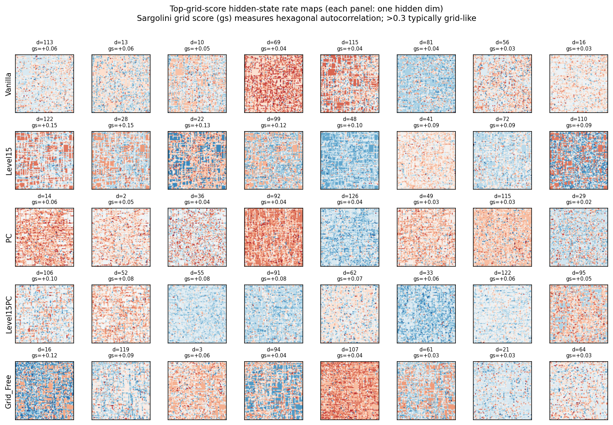

# Hippocampal Test A Revisited — Hidden-State Rate Maps

The original Test A queried individual path-integrator blocks and found stripe-like 1D patterns. That test was *correct in what it measured but wrong as a test of hexagonality*: each MapFormer block has ONE 1D phase angle per frequency, so by construction it cannot exhibit hexagonal interference (which requires 3 waves at 60° at the same frequency).

Hexagonality, if present, must emerge at the **hidden-state level**, where attention and FFN can mix multiple path-integrator blocks. We extract the hidden state (output of `out_norm`) at every visited cell, then compute spatial autocorrelation grid scores per hidden dim.

## Top-grid-score hidden dim per variant

| Variant | max grid score | # dims with score > 0.3 | # dims with score > 0 |
|---|---|---|---|
| Vanilla | +0.062 | 0 | 21 |
| Level15 | +0.155 | 0 | 61 |
| PC | +0.055 | 0 | 18 |
| Level15PC | +0.102 | 0 | 26 |
| Grid_Free | +0.124 | 0 | 18 |

*Auto-generated by `hippocampal_hidden_eval.py`.*
