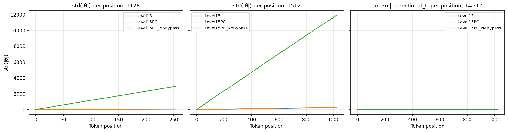
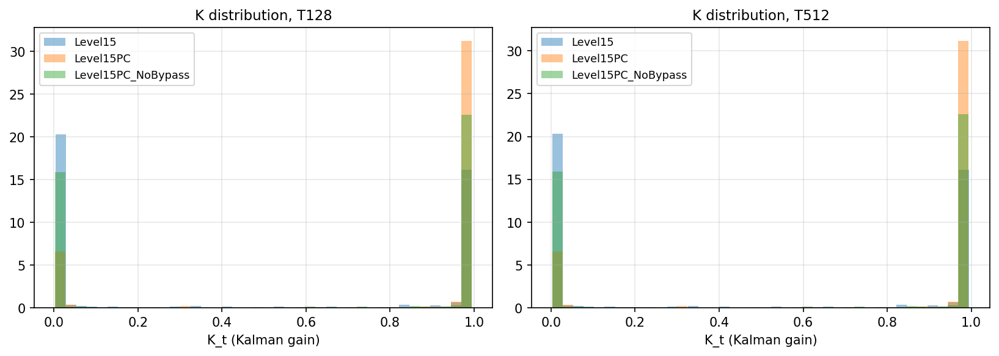
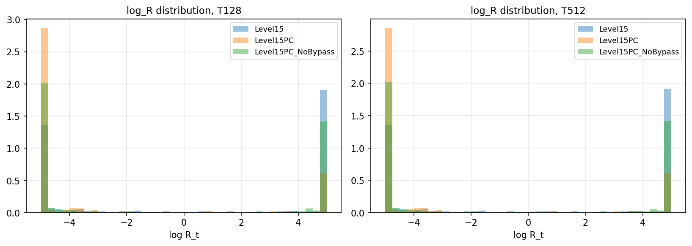

# Length-generalization diagnostic

Config: **lm200**, model seed 0, OOD env seed 12345, 5 trajectories per length.

All quantities averaged across trajectories, heads, blocks. `d_t = theta_hat - theta_path` is the correction magnitude.

## Statistics by variant and length

| Variant | T | mean(|θ̂|) | std(|θ̂|) | mean(|d|) | mean(K) | mean(K, last 25%) | mean(R) | mean(R, last 25%) |
|---|---|---|---|---|---|---|---|---|
| Level15 | T128 | 28.898 | 48.770 | 1.023 | 0.453 | 0.457 | 72.736 | 71.811 |
| Level15 | T512 | 83.247 | 157.633 | 1.021 | 0.452 | 0.453 | 72.845 | 72.457 |
| Level15PC | T128 | 30.539 | 51.946 | 1.422 | 0.808 | 0.811 | 23.261 | 22.947 |
| Level15PC | T512 | 105.125 | 186.290 | 1.434 | 0.807 | 0.807 | 23.206 | 23.124 |
| Level15PC_NoBypass | T128 | 947.092 | 1795.003 | 1.256 | 0.588 | 0.589 | 55.387 | 55.179 |
| Level15PC_NoBypass | T512 | 3840.580 | 7273.748 | 1.250 | 0.588 | 0.589 | 55.352 | 54.959 |

## Per-position drift (does θ̂ wander?)

If a variant's θ̂ standard deviation grows monotonically over trajectory positions, it's drifting. Compare growth at T=512 vs T=128.

*Auto-generated by `length_diagnostic.py`.*
