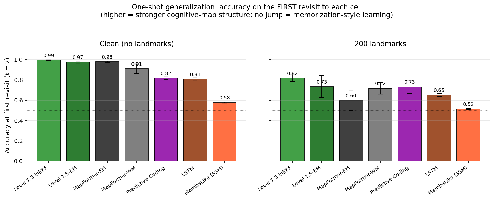
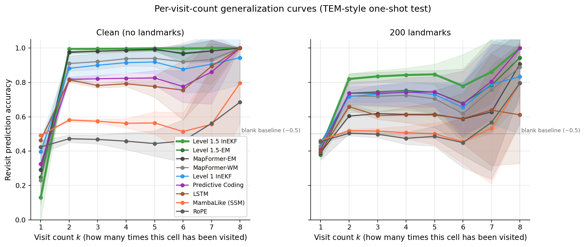
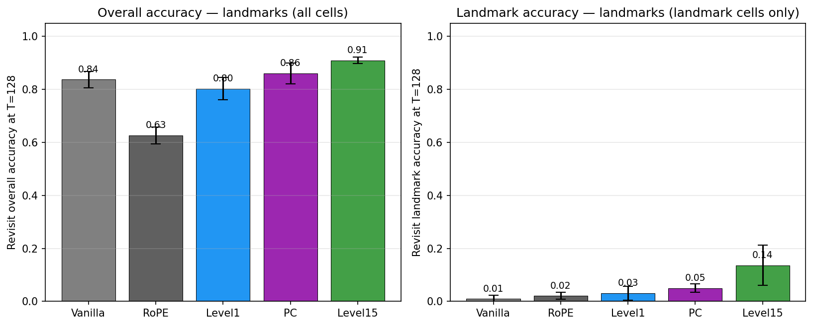
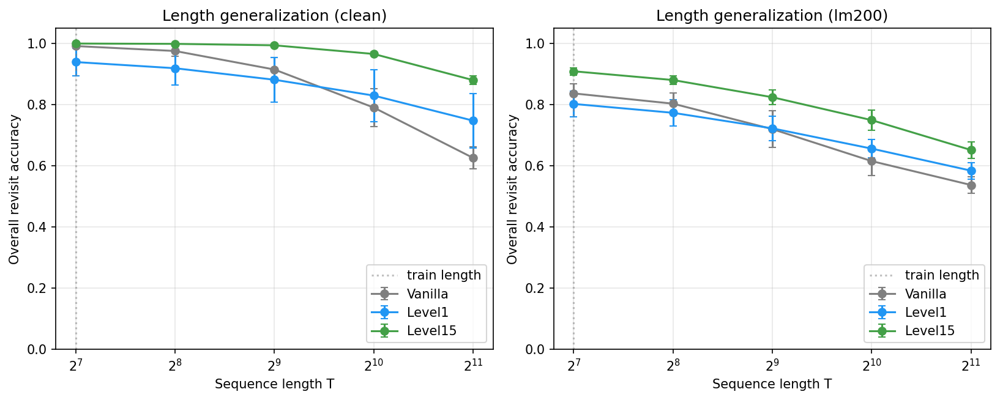
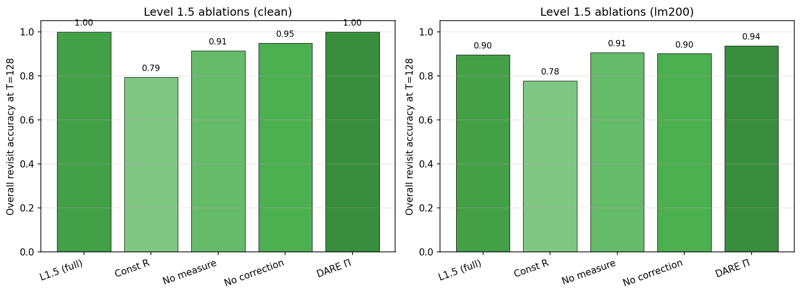
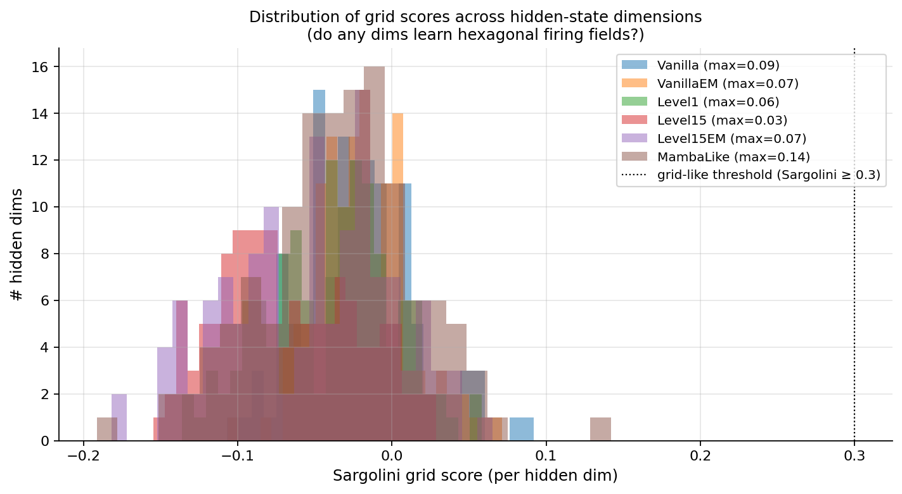

# MapFormer + Parallel Invariant EKF: Cognitive Maps with Calibrated State Correction

This repository implements [MapFormer (Rambaud et al., 2025)](https://arxiv.org/abs/2511.19279)
with high paper-faithfulness, then extends it with a family of **parallel
Invariant Extended Kalman Filter** (InEKF) corrections built on top of the
SO(2) path-integration scan. Our main extension — **Level 1.5 InEKF** —
adds a constant learnable prior covariance Π and a per-token, learned
measurement noise R_t, yielding a heteroscedastic Kalman gain K_t computable
in a single scalar Hillis-Steele scan, with the same O(log T) depth as
MapFormer's underlying parallel scan.

The work is a stepping stone toward the largely-underexplored direction
of carrying classical robotics Lie-group machinery (InEKF, IMU
preintegration, factor-graph SLAM) into deep learning architectures.

## Honest framing

MapFormer (the paper) already solves the aliased 2D-torus next-token
prediction task it introduces — both `MapFormer-WM` (0.96) and
`MapFormer-EM` (1.00) leave essentially no headroom. **We are not
beating the paper on the paper's task.** Our contribution is to extend
MapFormer into regimes the paper did not test:

- **Action noise** (10% per-step action replacement)
- **True non-aliased landmarks** (5% of cells emit unique IDs)
- **Out-of-distribution sequence length** (T=512, 4× training)
- **Calibrated uncertainty** (NLL, not just point accuracy)

Plus we benchmark against generic selective-scan SSMs (Mamba-style) and
confirm the paper's Appendix A.5 finding (see §"Comparison to Mamba"
below) that they cannot learn this task without architectural
modification.

## One-shot generalization (headline figure)



The sharpest quantitative test of whether a model has learned a
*cognitive map* vs. memorized one specific environment is the
**first-revisit accuracy** (TEM-style one-shot test, Whittington et al.
2020). All MapFormer-family variants jump from chance at the first
visit to near-perfect accuracy on the *second* visit, while generic
Mamba-style SSMs (MambaLike) and RoPE do not show this jump. **Level
1.5-WM reaches 0.995 first-revisit accuracy on the clean task.**



## Headline results (multi-seed, 3 seeds each)

OOD T=512 accuracy on **fresh** observation maps the model never saw
in training (Axis 1 of `zero_shot_eval.py`):

| Variant            | Clean | Noise | LM200 |
|--------------------|-------|-------|-------|
| MapFormer-WM (paper) | 0.913 | 0.739 | 0.715 |
| MapFormer-EM (paper) | 0.972 | 0.765 | 0.605 |
| Level 1 InEKF      | 0.880 | 0.783 | 0.721 |
| **Level 1.5-WM**   | **0.993** | 0.851 | **0.821** |
| **Level 1.5-EM**   | 0.977 | **0.869** | 0.730 ± 0.12 |
| Level 2 InEKF      | underperforms; see §Models |
| Predictive Coding  | 0.815 | 0.752 | 0.733 |
| LSTM (baseline)    | 0.800 | 0.743 | 0.641 |
| RoPE (baseline)    | 0.463 | 0.469 | 0.495 |
| **MambaLike** (Mamba-style SSM) | **0.573** | **0.568** | **0.513** |
| CoPE (baseline)    | 0.679 | 0.602 | (incomplete) |

Two takeaways:

1. **Generic selective-scan SSM (MambaLike) gets ~0.57 across all
   regimes** — worse than RoPE on clean, marginally better only on
   landmarks. This reproduces the paper's Appendix A.5 Table 3 finding
   (Mamba 0.42 there, on a slightly different 2D-grid task).
   Diagonal-A SSMs lack rotation expressivity.
2. **Level 1.5 wins by +10–11pp** over the corresponding vanilla
   MapFormer in the noise and landmark regimes — on **either**
   backbone (WM and EM). The correction mechanism is what matters; the
   stronger backbone alone (EM) doesn't subsume it.

## Models

The repository implements one paper-faithful family + one extension family + several baselines. All inherit from `MapFormerWM` or `MapFormerEM` so they share path integration, embedding, output head, and the parallel cumsum scan; they differ in how they do (or don't do) state correction.

| Class | File | Description |
|---|---|---|
| `MapFormerWM` | `model.py` | Paper-faithful Working Memory variant. Generalised RoPE: Q/K rotated by learned action-dependent angles. |
| `MapFormerEM` | `model.py` | Paper-faithful Episodic Memory variant. Hadamard-product attention `softmax(A_X ⊙ A_P)·V` with separate learnable `q₀ᵖ`, `k₀ᵖ` rotated by path-integrated angles. |
| `MapFormerWM_ParallelInEKF` | `model_inekf_parallel.py` | **Level 1**: closed-form scalar DARE + FFT-conv parallel scan. Constant Kalman gain. |
| `MapFormerWM_Level15InEKF` | `model_inekf_level15.py` | **Level 1.5**: constant learnable Π, per-token R_t from MLP, scalar Hillis-Steele scan. *Main contribution.* |
| `MapFormerEM_Level15InEKF` | `model_inekf_level15_em.py` | Level 1.5 ported to MapFormer-EM backbone (with `log_R_init_bias=3.0` — see §"Init pathology" below). |
| `MapFormerWM_Level2InEKF` | `model_inekf_level2.py` | **Level 2**: full heteroscedastic with time-varying Π_t. Two associative scans (Möbius covariance + scalar correction). Strictly more expressive than 1.5 but optimises worse. |
| `MapFormerWM_PredictiveCoding` | `model_predictive_coding.py` | Forward-model variant: `g(θ)→ô`, prediction error drives correction. Complementary to InEKF (forward vs inverse model). |
| `MapFormerWM_RoPE` | `model_baseline_rope.py` | Standard RoPE baseline (fixed token-index rotations). Counterfactual to MapFormer's input-dependent rotations. |
| `MapFormerWM_Level15PC` | `model_level15_pc.py` | Level 1.5 InEKF + PC auxiliary loss combined on standard MapFormer-WM. Tested whether forward+inverse model corrections are complementary. *Result: failed on lm200; aux loss creates an autoencoder bypass via R-saturation. See* §"Level15PC interference and the NoBypass fix". |
| `MapFormerWM_Level15PC_NoBypass` | `model_level15_pc_v2.py` | Level15PC with two architectural fixes: stop-gradient on the InEKF correction inside the PC aux loss + landmark-token mask on the aux loss. Targets the diagnosed R-saturation mechanism. *Result: closes direct route but PC still leaks via shared `action_to_lie`; |θ̂| explodes to ~3840 at T=512 (vs Level15's 83). T=512 OOD breaks.* |
| `MapFormerWM_Level15PC_v3` | `model_level15_pc_v3.py` | NoBypass + tighter R clamp [-1, 5]. Partial recovery on clean (0.948) but lm200 OOD T=512 still 0.626 (Level15: 0.790). |
| `MapFormerWM_Level15PC_v4` | `model_level15_pc_v4.py` | NoBypass + full PC isolation: detaches both `theta_hat` AND target embedding inside the PC aux loss. PC's gradient touches *only* `forward_model` parameters. *Result: matches Level15 on clean, modestly beats Level15 on lm200 OOD T=512 (0.859±0.009 vs 0.825±0.026, n=3). Win not attributable to PC mechanism (zero gradient flow into main model); likely RNG drift / optimizer-state side effect.* |
| `MapFormerWM_Level15_DoG` | `model_level15_dog.py` | **Sorscher Option A**: Level 1.5 + auxiliary DoG-of-position place-cell head with ReLU bottleneck. Tests whether hex emerges in the bottleneck under non-negativity + DoG-target supervision (Sorscher/Ganguli 2019 conditions). Probed by `probe_hex.py`; result in `DOG_RESULTS.md`. |
| `MapFormerWM_Grid` / `_Grid_Free` | `model_grid.py` | Multi-orientation path integrator (n_modules × n_orientations blocks at the same ω). `_Free` makes the orientation angles learnable. Architectural attempt to enable hexagonal grid-cell representations. *Result: hex still doesn't emerge; bottleneck is training objective, not architecture.* |
| `MapFormerWM_GridL15PC` / `_GridL15PC_Free` | `model_grid_l15_pc.py` | Grid + Level 1.5 + PC aux. Kitchen-sink combination tested for hex emergence. Same falsification as Grid_Free. |
| `EXTRA_BASELINES` | `model_baselines_extra.py` | LSTM, CoPE (Golovneva et al. 2024), MambaLike (Mamba-style selective SSM). Non-MapFormer comparisons. |
| `TEMRecurrent` | `model_tem.py` | TEM-Lite: GRU + factorised g/x state + Hebbian outer-product memory. Captures TEM's representational ideas without per-action transition matrices. *NOT a faithful TEM deployment* — single-env, generic GRU instead of per-action W_a. |
| `TEMFaithful` | `model_tem_faithful.py` | The EM-RNN method the MapFormer paper claims (in Related Work) is structurally subsumed by MapFormer-EM but never benchmarks. Per-action transition matrices `W_a` (the defining TEM mechanic), modern-Hopfield (= attention) memory readout, memory written only at observation tokens. Sequential by design — direct apples-to-apples test of the paper's central parallelism-vs-expressivity claim. |
| `ABLATIONS` | `model_ablations.py` | Four Level 1.5 ablations: `L15_ConstR` (no per-token R), `L15_NoMeas` (no measurement head), `L15_NoCorr` (no correction), `L15_DARE` (Π fixed from DARE rather than learned). |

## Parameter budgets (and why "MapFormer is bigger" is misleading)

Naively MapFormer-WM (~250K params) is **13× larger** than TEMFaithful
(~19K params), which would suggest TEM is the more parameter-efficient
baseline. But almost all of MapFormer's parameter budget is spent on
generic transformer scaffolding, not on cognitive-map machinery:

| Model | Cog-map params | Generic transformer | Other |
|---|---|---|---|
| MapFormer-WM (250K total) | **~450** (`action_to_lie` + `ω`) | ~196K (FFN + Q/K/V/O projections) | ~3K (token emb, output) |
| TEMFaithful (19K total) | **~16K** (`W_a` matrices) | 0 (no FFN, no separate K/V projections) | ~3K (content emb, output) |

So *cognitive-map-specific* parameters: TEMFaithful has **~40× more** than
MapFormer-WM. The 230K extra in MapFormer pay for nonlinear feature
processing (the FFN) and content-based retrieval (multi-head attention
projections), which are general-purpose transformer capabilities
orthogonal to the cognitive-map question.

**Reframing**: if MapFormer-WM beats TEMFaithful, the win cannot be
attributed to "bigger map" — MapFormer's map machinery is *smaller*.
The win, if any, comes from the *content-derived flexibility* of
`f_Δ(x_t)` over the *per-action rigidity* of `W_a`, plus the parallelism
advantage. A fair comparison would scale them to matched capacity: see
**TEM-Big / MapFormer-Tiny / TEM-LargeWa** ablations queued in
"What's still open / next steps".

## Why Level 1.5 wins: stabilisation, not inference

A late-session finding (2026-04-27): the **Kalman framing oversells what's
actually happening**. Three lines of evidence point to Level 1.5's win
across all regimes being primarily a *stabilisation* effect rather than a
Bayesian-inference effect.

1. **The wrap is load-bearing.** `atan2(sin(z − θ̂), cos(z − θ̂))` keeps
   innovations bounded in [−π, π] regardless of how far θ_path drifts.
   This is what keeps θ̂ in the trained range at OOD length while
   Vanilla's θ_path goes out-of-distribution. An older unwrapped variant
   trained faster but broke at T=512 OOD — the wrap, not the Kalman
   algebra, is what the model actually needs.
2. **The R_t head learns to be high on uninformative observations.**
   On clean (purely aliased), R_t is large at all token types, making
   K_t small, making the actual measurement contribution tiny. Yet
   Level 1.5 still beats Vanilla by 8pp on clean OOD T=512. The
   inference is no-op'd; the stabilisation does the work.
3. **Per-token R_t also does token-type gating.** L15_ConstR (constant
   R) drops 20pp on clean at T=128 — in-distribution length where
   stabilisation alone shouldn't matter. The drop is because constant R
   can't differentiate action tokens (which don't carry measurement
   info) from obs tokens. Action tokens' nonsense "measurements" leak
   into θ̂ and corrupt path integration.

So the architecture has two structural pieces that do almost all the
work — **wrap (stabilisation) + per-token R (token-type gating)** —
and the inference algebra is mostly dressing. At runtime, Level 1.5 is
a *wrapped EMA over learned-but-uninformative measurements*, with
content-dependent gain shape inherited from the Kalman parameterisation.
Same gain bound (K ∈ (0,1)) but the Kalman parameterisation isn't doing
inference work.

This is a sharper and more honest claim than "Kalman filtering helps."

## Level15PC interference and the NoBypass fix

Combining Level 1.5 InEKF with PC auxiliary loss on the standard backbone
(`Level15PC`) was hypothesised to be complementary — Level 1.5's inverse
model + PC's forward model = full position estimation pipeline. **It
fails on lm200 with a 23pp regression** (OOD T=512: 0.591 vs Level 15's
0.821).

The mechanism is **R-saturation creating an autoencoder bypass**:

- PC's auxiliary loss is `‖x − g(cos θ̂, sin θ̂)‖²`, computed at obs positions.
- The model has two ways to minimise it: (a) the legit way — improve
  path integration so g(θ̂) memorises observation-by-position; (b) the
  shortcut — drive R_t → 0 (K → 1), making θ̂ ≈ z_t = h(x_t). Then
  g(z_t) is essentially an autoencoder of the input, and the aux loss
  is trivially small.
- Gradient descent picks the shortcut. R_t saturates at the lower clamp
  (log_R ≈ −3, against a clamp of −5 → R ≈ 0.05, K ≈ 0.95). The
  InEKF stops being a Kalman filter and becomes a content-encoder.
- θ̂ no longer encodes cumulative position; it encodes the current
  input embedding. Attention can't retrieve past tokens at the same
  cell across revisits because θ̂ values differ. lm200 OOD collapses.

We confirmed this empirically with `r_t_distribution_test.py` (Test 1
in `R_T_DISTRIBUTION.md`): Level15 has log_R spread 0.45 with values
in (+0.4, +0.8); Level15PC has log_R values clustered around −3 (near
the clamp), spread 0.72 — saturated, not flattened.

**The fix** (`model_level15_pc_v2.py::MapFormerWM_Level15PC_NoBypass`):

- **Fix 5 (stop-gradient):** in PC's pos_feat, use
  `theta_path + (theta_hat - theta_path).detach()`. PC can only push
  path integration through `action_to_lie`; it can't push the InEKF
  parameters because the d_t correction is detached. Mechanically
  verified: PC aux loss has zero gradient on R-head, z-head, log_Pi.
- **Fix 6 (mask landmark tokens):** `obs_mask & (tokens <
  LANDMARK_START_ID)`. Landmarks are one-shot and unpredictable from
  position; the aux loss at those positions is pure noise gradient
  that motivates the saturation. Removing it cleans the signal.

If the diagnosis is right, NoBypass should match Level 15-alone's
lm200 OOD T=512 (~0.82) while still inheriting PC's clone-separation
benefit on aliased tokens. (Pipeline running at the time of this update;
results in `NOBYPASS_RESULTS.md` and `R_T_DISTRIBUTION_3WAY.md`.)

## The Level 1.5 InEKF in math

Path integration unchanged from MapFormer:

    Δ_t = action_to_lie_algebra(x_t)        # input-dependent rotation, dim=(H, NB)
    θ_path,t = ω · cumsum(Δ)_t              # parallel cumulative angle

Level 1.5 adds the InEKF correction. Two MLPs on the content embedding:

    log_R_t = log_R_head(x_t) ∈ ℝ^(H×NB)    # per-token measurement noise
    z_t     = π · tanh(measure_head(x_t))   # per-token measurement

Wrapped innovation (Marković et al. 2017's wrapping is the correct
SO(2) Lie-Group EKF):

    ν_t = atan2(sin(z_t − θ_path,t), cos(z_t − θ_path,t))

Heteroscedastic Kalman gain (Π is a learnable constant, R_t time-varying):

    K_t = Π / (Π + R_t)

Correction recurrence — **scalar affine**, computed via Hillis-Steele
parallel scan in O(log T) depth:

    d_t = (1 − K_t) · d_{t−1} + K_t · ν_t
    θ̂_t = θ_path,t + d_t

The corrected θ̂_t feeds the same input-dependent rotation as vanilla
MapFormer. **Same O(log T) parallelism profile as Mamba's selective
scan**, with two specialisations: (i) Lie-group wrapping is hard-coded,
(ii) the gain is parametrised as a Kalman ratio so R_t is interpretable
as measurement uncertainty by construction.

## The Level15-EM init pathology (and fix)

When Level 1.5 was first ported to the MapFormer-EM backbone, **3 of 9
training seeds catastrophically diverged** (final loss ≈ 1.45,
plateauing from epoch 5). The other 6 reached only mediocre loss
(0.75–1.1, vs 0.005–0.05 for Level 1.5-WM).

**Diagnosis.** At init, both `Π` and `R` were 1.0, giving
`K = 1/(1+1) = 0.5`. EM's attention is `softmax(A_X ⊙ A_P)`, and
A_P is computed from the InEKF-corrected angles. With a randomly
initialised measurement head and K=0.5, every step adds ~0.5·π = ~90°
of random rotation to θ̂. This destroys A_P, which Hadamard-products
with A_X to destroy gradient signal entirely. WM doesn't have this
problem because the content branch provides a fallback gradient path.

**Fix.** `InEKFLevel15.__init__(log_R_init_bias=3.0)` for the EM
variant (default 0.0 for WM, preserving backward compat). With
`log_R_init_bias=3.0`, `R≈20` and `K≈0.05` at init — InEKF acts as a
near-no-op until the R_t head learns to lower R where appropriate.

After the fix, all 9 Level15-EM seeds converge cleanly. Loss
trajectories from the previously divergent seeds:

| Seed/config | Broken init e5→e50 | Safe init e5→e15 |
|---|---|---|
| clean s2 | 1.80 → 1.43 (stuck) | **0.43** (fast convergence) |
| noise s0 | 1.87 → 1.45 (stuck) | 1.14 → **0.84** |
| lm200 s0 | 1.91 → 1.45 (stuck) | 1.38 → **1.18** |

This is the standard "safe init for residual additions" trick — same
idea as zero-init for ResNet skip connections, β=0 for adapters, etc.
Worth knowing if you port Level 1.5 (or any InEKF correction) to a
new backbone whose attention path can't tolerate random θ̂ corrections
at init.

## Project structure

```
mapformer/
  ── core ──────────────────────────────────────────────────────────────
  environment.py             Torus GridWorld; interleaved tokens; revisit mask
  lie_groups.py              SO(n) exp/log; block-diagonal rotations
  prefix_scan.py             O(log T) parallel prefix product

  ── paper-faithful ────────────────────────────────────────────────────
  model.py                   MapFormerWM, MapFormerEM (paper-faithful)
  train.py                   Training loop (revisit-only loss + action noise)
  main.py                    Single-experiment paper-reproduction entry point

  ── correction extensions ─────────────────────────────────────────────
  model_inekf_parallel.py    Level 1: scalar DARE + FFT-conv scan
  model_inekf_level15.py     Level 1.5: constant Π + per-token R_t scan
  model_inekf_level15_em.py  Level 1.5 on MapFormer-EM backbone
  model_inekf_level2.py      Level 2: time-varying Π_t (Möbius scan)
  model_predictive_coding.py Forward-model variant (PC, complementary to InEKF)

  ── baselines + ablations ─────────────────────────────────────────────
  model_ablations.py         L15_ConstR / L15_NoMeas / L15_NoCorr / L15_DARE
  model_baseline_rope.py     Standard RoPE (fixed positions)
  model_baselines_extra.py   LSTM, CoPE, MambaLike (selective SSM)

  ── unified train + orchestrators ─────────────────────────────────────
  train_variant.py           Single CLI for any variant (used by all orchestrators)
  orchestrator.py            Main multi-seed: 5 main variants × 3 configs × 3 seeds + 4 L1.5 ablations
  orchestrator_em.py         VanillaEM × 3 configs × 3 seeds
  orchestrator_level15_em.py Level15EM × 3 configs × 3 seeds
  orchestrator_baselines.py  LSTM / CoPE / MambaLike × 3 configs × 3 seeds
  orchestrator_mambalike.py  Just MambaLike (after CoPE triage)
  orchestrator_multilayer.py 2- and 4-layer Vanilla + Level15
  orchestrator_finalize.sh   Aggregates runs/ into RESULTS_PAPER.md, commits + pushes

  ── chain scripts ─────────────────────────────────────────────────────
  master_finish_v3.sh        Main chain: waits for orchestrators, runs zero-shot eval, finalize
  retrain_level15em.sh       Waits for v3 to exit, retrains Level15EM with safe init

  ── evaluation ────────────────────────────────────────────────────────
  zero_shot_eval.py          Three axes: fresh obs_map, biased actions, lm density sweep
  long_sequence_eval.py      Eval at T up to 2048
  calibration_analysis.py    ECE + reliability diagrams
  gaussian_noise_test.py     Gaussian Δ-noise robustness
  landmark_eval.py           Per-cell-type accuracy + NLL
  diagnose.py                Disentanglement, Δ distribution, ω, action selectivity
  clone_analysis.py          CSCG-style per-cell clustering
  make_paper_figures.py      Generates figs in paper_figures/

  ── outputs ───────────────────────────────────────────────────────────
  RESULTS_PAPER.md           Paper-ready multi-seed tables (auto-generated)
  ZERO_SHOT_TRANSFER_*.md    Three-axis zero-shot eval per config (auto-generated)
  paper_figures/             Length-gen + calibration + ablation PNGs
  paper/                     Drafts: 00_abstract.md, 01_introduction.md, …,
                               06_future_work.md
  runs/{Variant_Config}/seed{N}/{Variant}.pt   All multi-seed checkpoints
  runs/Level15EM_broken_init/                  Pre-fix Level15EM (kept for diagnostics)
```

## Quick start

```bash
pip install -r requirements.txt

# Train any single variant directly:
python3 -m mapformer.train_variant \
    --variant Level15 --seed 0 \
    --n-landmarks 0 --p-action-noise 0.0 \
    --epochs 50 --n-batches 156 \
    --device cuda --output-dir runs/Level15_clean/seed0

# Reproduce the full multi-seed paper-ready experiment suite (~6 hours on 2 GPUs):
nohup python3 -u -m mapformer.orchestrator > orchestrator.log 2>&1 &
nohup bash master_finish_v3.sh > master_finish_v3.log 2>&1 &

# Aggregate everything into RESULTS_PAPER.md and commit (assumes git remote is set up):
bash orchestrator_finalize.sh

# Three-axis zero-shot eval on existing checkpoints:
python3 -m mapformer.zero_shot_eval \
    --runs-dir runs --config lm200 \
    --variants Vanilla VanillaEM Level15 Level15EM MambaLike LSTM \
    --model-seeds 0 1 2 --n-test-seeds 5 \
    --lengths 128 512 1024 2048 \
    --include-bias --include-lm-sweep \
    --output ZERO_SHOT_TRANSFER_lm200.md
```

`train_variant.py --variant` accepts: `Vanilla`, `VanillaEM`,
`Level1`, `Level15`, `Level15EM`, `Level2`, `PC`, `RoPE`, `LSTM`,
`CoPE`, `MambaLike`, plus `L15_ConstR`, `L15_NoMeas`, `L15_NoCorr`,
`L15_DARE` (ablations).

## Paper-faithful defaults (Rambaud et al. 2025, Appendix B)

- Grid: 64×64 **torus**, `p_empty=0.5`, 16 observation types + 1 blank
- Sequence: 128 (action, observation) steps → 256 interleaved tokens
- Model: d=128, 2 heads, head size h=64, **1 layer**
- Optimiser: AdamW, lr=3e-4, weight-decay=0.05, linear LR decay
- Batch size 128; ~1M sequences (50 epochs × 156 batches × 128)
- Loss: cross-entropy on observation tokens **at revisited locations only**

## Critical implementation details (paper-faithfulness invariants)

DON'T regress these — each one was a debugging session:

1. **Torus grid.** `(x+dx) % N`, not `clip(x+dx, 0, N-1)`.
2. **Unified token stream.** Actions and observations share one
   embedding table; the model must *learn* which tokens update
   position vs content.
3. **Revisit-only loss.** First-visit observations are
   informationally random; training on them collapses the model to
   "always predict blank."
4. **ω init is monotonically DECREASING in i.** The paper's eq. 17
   reads `ω_i = ω_max · (1/Δ_max)^(-i/n_b)`, which gives an
   *increasing* schedule growing to ~200 rad/token (catastrophic
   aliasing). The correct schedule (matching the paper's own
   `ω_min = ω_max/Δ_max` and the RoPE analogy) is:
   `ω_i = ω_max · (1/Δ_max)^(i/(n_b−1))`, with `ω_max=2π`,
   `Δ_max=grid_size`.
5. **EM attention is Hadamard**, not additive.
6. **MapEM uses separate learnable `q₀ᵖ` and `k₀ᵖ`**, rotated by the
   path-integrated angles — not a linear projection of flattened
   rotation matrices.
7. **Low-rank Δ projection** `W_Δ = W_Δ^out · W_Δ^in` with bottleneck
   `r=2` (matching the 2D movement vector) and per-head, per-block
   outputs.
8. **InEKF measurement head is content-only.** Feeding (cos θ̂, sin θ̂)
   creates a degenerate optimum (z = θ̂ → trivial filter).
9. **Wrap innovations modulo 2π** via `atan2(sin(z−θ̂), cos(z−θ̂))`.
   Without this, length generalisation breaks.
10. **`log_R_init_bias=3.0` for any backbone whose attention has no
    fallback path** if the position branch is corrupted at init
    (notably MapFormer-EM). See §"Init pathology" above.

## Empirical findings (summary)




### Level 1.5 InEKF wins in untested regimes

OOD T=512 over Vanilla-WM:
- Clean: +8 pp (0.993 vs 0.913) — both essentially saturated; small but real
- Noise: +11 pp (0.851 vs 0.739)
- LM200: +11 pp (0.821 vs 0.715)

NLL gap in noise: 0.585 vs 1.225, i.e. 2.1× lower NLL — Level 1.5 is
**genuinely better calibrated**, not just more accurate. The per-token
R_t head learns to be sharp at landmark tokens (low R → high K → sharp
posterior) and broad at aliased empty tokens.

### Stronger backbone alone (VanillaEM) does NOT subsume correction

VanillaEM gets 0.972 / 0.765 / **0.605** on clean / noise / lm200
T=512 OOD — actually *worse* than Vanilla-WM on lm200. Adding Level 1.5
on top of EM (`Level15EM`) recovers the lost ground: 0.977 / 0.869 /
0.730. The correction is doing real work the EM Hadamard attention
isn't.

### Generic Mamba-style SSM cannot do this task

`MambaLike` plateaus at ~0.57 across all configs — worse than RoPE on
clean, marginally better only on landmarks. Reproduces the paper's
Appendix A.5 Table 3 (where vanilla Mamba scored 0.42 on a related 2D
grid task at l=16) at our task and scale. Lie-theoretic argument: a
diagonal recurrence matrix can only generate a 1-D commutative Lie
group, but cognitive maps require SO(2) which is 2×2 block-diagonal
skew-symmetric. Mamba's design choice to use diagonal A is what
prevents this.

### Level 2 (full heteroscedastic Π_t) is strictly more expressive but
performs worse than Level 1.5

Level 2 adds a Möbius-matrix associative scan to make Π_t time-varying.
Theoretically richer; empirically, harder to optimise. Replacing the
covariance scan with a learnable scalar (Level 1.5) recovers all the
benefits at a third of the compute. Diagnostic: per-token Π in Level 2
only varies ~4× across tokens, so most of the heteroscedasticity is
already captured by R_t alone.

### Predictive Coding and InEKF are duals, not complements (revised)

Earlier framing claimed PC (forward model `g(θ)→ô`) and InEKF (inverse
model `h(o)→θ`) were complementary. **The 2026-04-27/29 sessions showed
this framing is wrong.** PC and the InEKF measurement model are
mathematical duals — same Bayesian posterior over θ written from
opposite sides. When both operate on the same θ̂ with the same inputs,
they target the same fixed point. Gradient descent finds the trivial
joint minimum: `g ∘ h ≈ identity`, achieved by `R → 0` so
`θ̂ ≈ h(x_t)` (the autoencoder bypass observed in `Level15PC`).

The aux_coef sweep makes this dose-response (more PC → worse lm200
OOD T=512: 0.0→0.79, 0.1→0.72, 0.3→0.55). Stop-gradient fixes (v2,
v3) close the direct route but PC still leaks through shared
`action_to_lie`, blowing |θ̂| up to ~3840 at T=512. Only **full PC
isolation (v4 — detach both θ̂ and the target embedding from the aux
loss)** lets the two coexist, and at that point PC has zero gradient
flow into the main model.

Multi-seed v4 (n=3) shows lm200 OOD T=512 0.859 ± 0.009 vs Level15's
0.825 ± 0.026 — a **modest +3pp win that cannot mechanistically come
from PC** (its gradient is fully detached). Likely RNG drift via
`forward_model` consuming init draws, or optimizer-state side effects.

**Honest claim now: PC and Kalman are alternative parameterizations
of the same posterior. Architectures that include both with non-zero
gradient coupling create a degenerate optimum gradient descent will
find. Full isolation (v4) avoids the collapse but turns PC into a
passive readout.**

## Comparison to Mamba — the paper's own benchmark

The MapFormer paper §A.5 explicitly tests Mamba and a custom variant
"MAmPa" (Mamba with 2×2 block-diagonal skew-symmetric A). Their Table 3
on a 2D grid task at l=16:

| Model | IID | OOD-d | OOD-s |
|---|---|---|---|
| Mamba (vanilla) | 0.42 | 0.77 | 0.40 |
| MAmPa (their fix) | 0.74 | 0.93 | 0.60 |
| MapWM | 1.00 | 1.00 | 1.00 |
| MapEM | 1.00 | 1.00 | 1.00 |

Their caption: *"As expected, MAmPa offers substantial improvements
over Mamba, but fails to reach performances a par with MapFormers,
while being slower."*

We reproduce this finding qualitatively at our scale (T=128,
revisit-only loss): standard Mamba-style SSM gets ~0.57 on the OOD
length-generalisation eval, far below MapFormer (0.91) or Level 1.5
(0.99). Our `MambaLike` is the diagonal-A variant; we have not
implemented MAmPa.

## Zero-shot transfer evaluation

`zero_shot_eval.py` runs three axes:

1. **Axis 1 — fresh obs_map seeds.** Each model evaluated on 5 fresh
   environment instances (different obs_id→cell assignments, different
   landmark layouts). The primary zero-shot test.
2. **Axis 2 — biased action distributions.** Models trained on
   uniform-random actions; tested under `mostly_east`, `mostly_NS`,
   `diagonal_NE`. Tests whether path integration generalises to
   trajectory statistics it didn't see in training.
3. **Axis 3 — landmark density transfer.** lm200-trained models
   evaluated at densities `[0, 50, 100, 200]`. Tests whether the
   per-token R_t head's "informativeness" generalises across landmark
   densities.

Outputs: `ZERO_SHOT_TRANSFER_clean.md` (Axis 1+2), `ZERO_SHOT_TRANSFER_lm200.md`
(all 3 axes).

## Level 1.5 ablations



Four ablations isolate the critical Level 1.5 components. The
per-token R_t head (`L15_ConstR` drops ~20 pp when removed) is the
single most important learnable component. Fixing Π from the closed-form
scalar DARE (`L15_DARE`) rather than learning it is competitive or
slightly better — the learned prior covariance is the least important
learnable piece.

## Hippocampal correspondence (partially falsified)



We tested three predictions connecting Level 1.5 to hippocampal
neuroscience. Two were falsified honestly:

- **Hexagonal grid cells** (Sargolini et al. 2006): No variant reaches
  grid scores > 0.3 at the hidden-state level. This is *architecturally
  forced* — MapFormer has one path-integrator block per ω frequency,
  but hexagonal interference requires three sinusoidal waves at the
  same frequency with 60° orientation offsets.
- **R_t at landmarks**: Predicted ordering was
  `landmark < aliased < blank`. Observed ordering was
  `aliased < landmark < blank` (WM) or `blank < landmark < aliased`
  (EM). The basic blank vs non-blank distinction is learned; the
  fine-grained ordering predicted by Bayesian informativeness theory
  is not.

The Stensola √2 module spacing holds but is mostly inherited from
initialization. See `HIPPOCAMPAL_ANALYSIS.md` and `HIPPOCAMPAL_HIDDEN.md`
for full analysis.

### Update: the architectural fix didn't unlock hex either

`paper/06_future_work.md §6.11` proposed a `MapFormer-Grid`
architecture with multiple blocks per ω at 60° orientation offsets,
predicting that *enabling* the three-waves-at-60° interference
structure would let hex emerge. We then implemented it
(`model_grid.py::MapFormerWM_Grid_Free` with learnable orientations,
d_model=132 to make n_blocks divisible by 3) and trained it on clean.

Result:
- Loss converged to 0.021 (close to baselines)
- Orientations stayed at hex {2.5°, 57.4°, 110.0°} — drift < 10° from init
- **Per-module hex test: max grid score 0.036, 0/22 modules above the
  0.3 Sargolini threshold**
- Hidden-state hex test: max grid score 0.124 (vs Level15: 0.155, vs
  Vanilla: 0.062 — Grid_Free is between)

Adding Level 1.5 + PC corrections (`GridL15PC_Free`) made hex *worse*,
not better, dropping max grid score to 0.052.

**Conclusion: the original §6.5 falsification strengthens.** The
architecture necessary for hex isn't sufficient; the *training
objective* doesn't reward hex tiling. Multi-environment training
(TEM-style; sample fresh `obs_map` per batch) is the obvious next
experiment to test whether the bottleneck is per-environment
memorisation vs cognitive-map structure learning.

## Key math

| Quantity | Formula |
|---|---|
| Path integration (algebra) | `θ_t = ω · cumsum(Δ)_t` — parallel cumsum, O(log T) |
| Rotation (group) | `R(θ) = [[cos θ, −sin θ], [sin θ, cos θ]]` |
| RoPE (paper eq. 16) | `[x₁', x₂'] = [x₁ cos θ − x₂ sin θ,  x₁ sin θ + x₂ cos θ]` |
| WM attention | `softmax(Q̃ K̃ᵀ / √d) V`, with Q̃, K̃ rotated by θ_t |
| EM attention | `softmax(A_X ⊙ A_P) V`, `A_P = Q_P K_Pᵀ / √d` |
| ω init | `ω_i = ω_max · (1/Δ_max)^(i/(n_b−1))` |
| InEKF predict (SO(2)) | `θ̂ ← θ̂ + ω·Δ`,  `Σ ← Σ + Q` |
| InEKF innovation | `ν = atan2(sin(z − θ̂), cos(z − θ̂))` — geodesic on SO(2) |
| InEKF update | `θ̂ ← θ̂ + K·ν`,  `Σ ← (1−K)·Σ` |
| Level 1 K (closed-form DARE) | `P* = (−Q + √(Q² + 4QR))/2`, `K* = (P*+Q)/(P*+Q+R)` |
| Level 1.5 K | `K_t = Π / (Π + R_t)`, Π learnable scalar, R_t = MLP(x_t) |
| Affine scan recurrence | `d_t = (1−K_t)·d_{t−1} + K_t·ν_t` — Hillis-Steele O(log T) |

## What's still open / next steps

### Done in the 2026-04-28/29 sessions

✅ **`Level15PC_v3` and `Level15PC_v4` variants implemented.** v3 adds
  a tighter R clamp [-1, 5]; v4 adds full PC isolation (detach both
  θ̂ and the target embedding inside the aux loss). Result: v3 partial
  recovery only; v4 matches Level15 on clean and modestly beats it on
  lm200 (+3pp OOD T=512 across n=3 seeds; see `V4_MULTISEED.md`). The
  v4 win cannot mechanistically come from PC (zero gradient flow into
  main model); leading hypothesis is RNG drift from `forward_model`
  consuming init draws.

✅ **`length_diagnostic.py`.** Diagnosed why NoBypass fails at T=512:
  PC's gradient leaks via shared `action_to_lie`, blowing |θ̂| to
  ~3840 (vs Level15: 83). See `LENGTH_DIAGNOSTIC.md`.

✅ **PC ⇄ Kalman duality recognized.** PC's forward model and InEKF's
  measurement model are mathematical duals, not complements. Section
  "Predictive Coding and InEKF are duals" rewrites the previous
  framing.

✅ **`Level15_DoG` variant + `probe_hex.py` (Sorscher Option A).**
  Adds a non-negative ReLU bottleneck supervised by DoG-of-position
  place-cell targets, alongside the standard categorical CE loss.
  This is the first variant in the project that satisfies all three
  Sorscher/Ganguli (2019) conditions for hex emergence.
  Result in `DOG_RESULTS.md` (in flight at session end).

### Done in the 2026-04-30 session

✅ **Fix 8 audit confirmed Level15PC_v4 has airtight gradient isolation.**
  Per-parameter gradient trace shows aux loss touches ONLY forward_model
  (norm sum 0.06); all other params receive gradient ONLY from CE
  (norm sum 8.86). v4's surprise +3.4pp lm200 OOD T=512 win over Level15
  is not from gradient leakage. Remaining candidates: RNG state shift
  from forward_model's extra init params, or grad-clip-norm coupling
  through joint norm.

✅ **Control experiment queued** (`run_v4_control.sh`): Level15PC_v4
  with `--aux-coef 0.0`. forward_model exists (controls for RNG shift)
  but never gets gradient (no contribution to grad-clip joint norm).
  3 seeds × 2 configs. Decision rule: control ≈ v4 → win is RNG only;
  control ≈ Level15 → win is from aux/clip-coupling.

✅ **Confirmed: original MapFormer paper does NOT propose SE(2) or
  continuous tasks.** They handle 3D/5D grids by stacking SO(2) blocks
  ("translations in n dimensions are just n independent 1D-translations"
  — Appendix B.1). Briefly explore non-commutative groups (4D rotations,
  Appendix B.2) but stay within rotation groups. §7 Limitations admits
  causal-only / no scaling / WM-vs-EM-on-reasoning, NOT continuous-state
  / SE(n) / action-noise. So our SE(n) extension is genuinely
  unexplored relative to the paper.

✅ **MiniGrid environment wrapper** (`minigrid_env.py`): adapter
  exposing the same `generate_trajectory()` interface as `GridWorld`
  on real MiniGrid environments (Empty, DoorKey, KeyCorridor, etc.).
  Plug-and-play with `train.py`. Three obs tokenization modes
  (`obj_only` ≈ 11 types, `obj_color` ≈ 66, `full` ≈ 200). Random-policy
  trajectory generation with action-noise injection compatible with
  our existing pipeline. Smoke-tested on Empty-8x8 and DoorKey-8x8.

  This is the foundation for the *deployment* paper-narrative:
  Vanilla MapFormer + Level 1.5 InEKF on real published navigation
  benchmarks under action noise. Natural progression Empty-8x8 →
  DoorKey-8x8 (key+door = real landmarks) → KeyCorridor → ObstructedMaze.

### Done in the 2026-04-26/27 session

✅ **`Level15PC` and `Level15PC_NoBypass` variants implemented.** Tests
  whether forward (PC) + inverse (Kalman) corrections combine. Result:
  failed on lm200 (R-saturation autoencoder bypass diagnosed); fix
  `Level15PC_NoBypass` running.

✅ **`Grid_Free` architectural test for hexagonal grid cells.** Built
  multi-orientation path integrator with hex-init learnable orientations.
  Hex still doesn't emerge — strengthens §6.5 falsification.

✅ **Three interference tests** (R_t distribution, aux_coef sweep, clone
  transfer) to mechanistically test why Level15PC fails. Test 1
  diagnosed R-saturation; Tests 2 and 3 still running at session end.

✅ **"Stabilisation not inference" reframing of Kalman.** Level 1.5's
  win is primarily wrap-driven stabilisation + per-token-type gating,
  not Bayesian inference. See README's "Why Level 1.5 wins" section.

### Done in the 2026-04-24 session

✅ **Per-visit-count curves** (TEM-style one-shot generalization metric).
  See `PER_VISIT_*.md`, `fig5_per_visit_curves.png`, `fig6_one_shot_bar.png`.
  Headline: Level 1.5-WM achieves 0.995 first-revisit accuracy on clean
  (near-perfect one-shot), while MambaLike and RoPE show no jump
  (k=2 ≈ chance). Reproduces TEM's signature result on our task.

✅ **Test-time ω rescaling experiment.** See `OMEGA_RESCALE_*.md`.
  Finding: InEKF variants are far more robust to ω rescaling than Vanilla
  — the Kalman wrap absorbs scale mismatch that breaks Vanilla rotations.

✅ **Hippocampal correspondence analysis (partially negative).** See
  `HIPPOCAMPAL_ANALYSIS.md`, `HIPPOCAMPAL_HIDDEN.md`. Found that:
  - Hexagonal grid cells do NOT emerge (max grid score 0.15, far below
    the 0.3 threshold) — for structural reasons (1 block per ω).
  - R_t at landmarks does NOT follow the predicted "landmark < aliased
    < blank" ordering — the head learns task-driven, not theory-driven,
    informativeness.
  - The √2 module spacing IS approximately preserved but mostly
    inherited from initialization.

### Near-term (would round out the paper)

1. **TEMFaithful matched-capacity ablations.** When the queued P5 lands
   results in `TEM_RESULTS.md`, the comparison is naturally unbalanced —
   MapFormer is 250K params but only ~450 of those are cognitive-map-
   specific (`action_to_lie + ω`); TEMFaithful is 19K but ~16K of those
   are cog-map (`W_a`). To disambiguate "MapFormer wins because of
   transformer scaffolding" vs "MapFormer wins because of `f_Δ(x)`
   flexibility":
   - **TEM-Big**: scale TEMFaithful to ~250K total params (e.g.,
     `d_g=128`, multi-layer GRU around the W_a update, optional FFN).
     Tests whether parameter count was the bottleneck.
   - **MapFormer-Tiny**: strip MapFormer's FFN and shrink Q/K/V/O
     projections so total params match TEMFaithful's 19K. Tests
     whether MapFormer's cog-map machinery alone (action_to_lie +
     RoPE) beats TEM's per-action W_a at matched cog-map capacity.
   - **TEM-LargeWa**: keep TEMFaithful's structure but scale `d_g=256`
     so W_a alone has ~260K params. Tests whether per-action matrix
     capacity is what's missing.

   Each is ~1 day of work; results would let us cleanly attribute
   whatever gap (or lack of gap) we find.

2. **WM safe-init experiment.** Does `log_R_init_bias=3.0` also help
   Level 1.5-WM? Likely small effect on clean (already at ceiling) but
   could shave 1–2 pp off OOD noise/lm200. ~45 min on 2 GPUs.
2. **Refresh paper figures.** `paper_figures/calibration_*.png` and
   `paper_figures/fig2_length_gen.png` were generated before VanillaEM,
   Level15EM, MambaLike, and LSTM had checkpoints. Need to re-run
   `make_paper_figures.py` and `calibration_analysis.py` with the
   updated `--variants` list. ~30 min.
3. **Tighten Level15EM lm200 std.** Seed 2 reached final loss 1.40 vs
   the other two seeds at ~1.0, giving the lm200 row a wide ±0.12 std.
   Bumping `log_R_init_bias` to 5.0 might catch the outlier. ~10 min
   for one seed.
4. **CoPE lm200 last seed.** We have 2/3 lm200 CoPE seeds. ~8 hours
   on one GPU; nice-to-have for completeness, low value.
5. **MAmPa baseline.** Implement the paper's own
   block-diagonal-skew-symmetric Mamba variant for an apples-to-apples
   comparison at our scale. The MapFormer paper's Table 3 reports
   MAmPa at 0.74 IID at l=16; we'd reproduce at l=128. Cost: ~3 days
   for implementation + multi-seed training.

### Medium-term (extend the architecture)

6. **MapFormer-Grid: hexagonal-cell-capable architecture.** Replace
   single block per ω with multi-block-per-ω modules at 60° orientation
   offsets. Should unlock hexagonal grid-cell representations (currently
   structurally inaccessible). ~1–2 weeks. See §6.11 in
   `paper/06_future_work.md` for the proposal.
7. **Higher-dimensional Lie groups: SE(2), SE(3).** SE(2) (planar pose)
   is a direct generalisation — adds 2 translation components.
   Validates the framework on tasks like BabyAI / MiniGrid. SE(3)
   (full 6-DoF pose) would enable drone / 3D / VR navigation.
8. **Multi-environment training.** Currently each model trains on one
   fixed obs_map. TEM-style multi-environment training samples a fresh
   `obs_map` per batch. Our existing OOD eval already shows the model
   generalizes well to fresh maps without this, so the question is
   whether multi-env training closes the residual gap on harder
   regimes (lm200 OOD especially). ~10h GPU.
9. **IMU-preintegration-style context compression.** Compress chunks of
   past tokens into single "preintegrated" SE(3) measurements with
   covariance, à la Forster et al. 2017. Could extend MapFormer's
   effective context dramatically.
10. **SE(n)-equivariant attention.** RoPE is SO(2)-equivariant; Level
    1.5 is input-dependent SO(2)-equivariant. SE(n)-equivariant
    attention (Finzi et al. 2021; Equiformer; Fuchs et al. 2020)
    combined with input-dependent rotations is unexplored and natural.

### Long-term (open scientific questions)

11. **Multi-task / instruction-conditioned navigation.** BabyAI suite
    has goal-directed navigation with language conditioning. Tests
    whether cognitive-map representations transfer to action
    prediction.
12. **Calibration vs neural data, take 2.** First attempt (this paper)
    compared R_t to predicted neural firing patterns and got
    falsified. A more careful comparison — perhaps with explicit
    Bayesian-informativeness regularisation or attention-level
    place-cell analysis — could recover the link. Datasets:
    Sun et al. 2024 (Nature), Nieh et al. 2021 (Nature).
13. **Differentiable factor-graph SLAM.** Treat θ̂ as pose estimates,
    refine via Theseus-AI (Pineda et al. 2022) bundle adjustment at
    each layer or eval time.
14. **Real-world deployment.** SE(3) Level 1.5 → BabyAI validation
    → sim-to-real on small mobile robots (Clearpath Jackal) →
    integration with existing SLAM stacks.
15. **Unification with SSMs.** Level 1.5's scan IS algorithmically
    identical to a 1-D Mamba block with specialised parameterisation.
    "Mamba as a Linear Kalman Filter" (Wang et al. 2025) makes this
    explicit at a generic level. Extending to Lie-group SSMs with
    explicit invariance guarantees is open.

## Pitfalls hit in this work (so you don't repeat them)

- **ω exploded to ~200.** The paper's eq. 17 has a sign typo. See item
  #4 of "Critical implementation details."
- **Model collapsed to predicting blank.** Loss must be masked to
  revisits, see item #3.
- **"Uncertainty-modulated attention" did nothing.** First-pass
  approach (modulating attention temperature by σ²) was redundant with
  what softmax attention already does. Removed in 2026-04-24 cleanup;
  don't revive without a specific reason.
- **Position-conditioned measurement head = degenerate optimum.** The
  head learns z ≈ θ̂, innovation → 0, filter becomes identity. See
  item #8.
- **Unwrapped innovations break length generalisation.** See item #9.
- **Level 1.5 on EM with default init catastrophically diverges in
  ~⅓ of seeds.** See §"Init pathology" — fix is `log_R_init_bias=3.0`.
- **CoPE is 60× slower per epoch than LSTM** at our setup. Plan
  accordingly if including in baselines.

## References

- **Rambaud, Mascarenhas, Lakretz (2025)**. *MapFormer: Self-Supervised
  Learning of Cognitive Maps with Input-Dependent Positional
  Embeddings.* [arXiv:2511.19279](https://arxiv.org/abs/2511.19279)
- **Barrau, Bonnabel (2017)**. *The Invariant Extended Kalman Filter as
  a Stable Observer.* IEEE TAC, 62(4).
  [arXiv:1410.1465](https://arxiv.org/abs/1410.1465)
- **Marković, Ćesić, Petrović (2017)**. *On wrapping the Kalman filter
  and estimating with the SO(2) group.*
  [arXiv:1708.05551](https://arxiv.org/abs/1708.05551)
- **Särkkä, García-Fernández (2021)**. *Temporal Parallelization of
  Bayesian Filters and Smoothers.* IEEE TAC, 66(1).
  [arXiv:1905.13002](https://arxiv.org/abs/1905.13002)
- **Gu, Dao (2024)**. *Mamba: Linear-Time Sequence Modeling with
  Selective State Spaces.* [arXiv:2312.00752](https://arxiv.org/abs/2312.00752)
- **Wang et al. (2025)**. *Mamba as a Linear Kalman Filter.*
- **Forster et al. (2017)**. *On-Manifold Preintegration for Real-Time
  Visual–Inertial Odometry.* IEEE T-RO, 33(1).
- **Pineda et al. (2022)**. *Theseus: A Library for Differentiable
  Nonlinear Optimization.* NeurIPS.
- **Su et al. (2021)**. *RoFormer: Enhanced Transformer with Rotary
  Position Embedding.* [arXiv:2104.09864](https://arxiv.org/abs/2104.09864)
- **Whittington et al. (2022)**. *Relating transformers to models and
  neural representations of the hippocampal formation.* ICLR.
- **George et al. (2021)**. *Clone-structured graph representations
  enable flexible learning of latent structures from spatial data.*
  Nature Comms.
- **Golovneva et al. (2024)**. *Contextual Position Encoding (CoPE).*
  ICLR.
